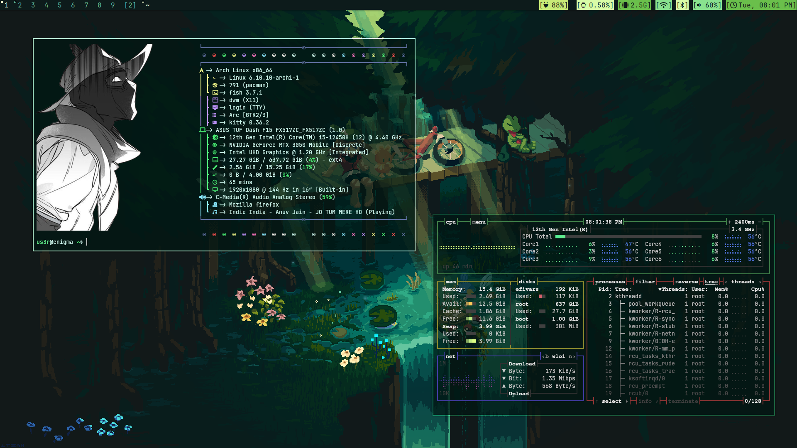

# My DWM Configuration

## Looks



## Display Manager Configuration
File Location: `/usr/share/xsessions/dwm.desktop`

```bash
Copy code
[Desktop Entry]
Encoding=UTF-8
Name=dwm
Comment=Dynamic Window Manager
Exec=/usr/local/bin/dwm
Icon=dwm
Type=XSession
```
This configuration sets up dwm as your dynamic window manager for X sessions. Just ensure that the path to dwm is correct and the executable is properly installed in /usr/local/bin/.

## Touchpad Gestures
File Location: `/etc/X11/xorg.conf.d/30-touchpad.conf`

```bash
Copy code
Section "InputClass"
    Identifier "touchpad"
    Driver "libinput"
    MatchIsTouchpad "on"
    Option "Tapping" "on"
    Option "TappingButtonMap" "lrm"
    Option "NaturalScrolling" "true"
EndSection
```
This setup configures your touchpad with libinput to support tapping, set the button map for tapping to left-right-middle, and enables natural scrolling for a smoother experience.

## Laptop Sleep Settings
To configure your laptop to sleep on lid close and power button press, edit the following settings in:

File Location: `/etc/systemd/logind.conf`

Uncomment and modify these lines:

```bash
Copy code
HandleLidSwitch=suspend
HandlePowerKey=suspend
HandlePowerKeyLongPress=poweroff
```
This ensures your laptop will suspend when you close the lid or press the power button, and shut down if you long-press the power button.

## GRUB Bootloader and EFI Partition
When using GRUB as your bootloader, you might find that it doesn’t show Windows boot options due to being on a different partition. To fix this, you can mount the Arch EFI partition to access and manage the boot entries.

Steps to make Windows boot options visible:

- **Mount the EFI partition:** Mount the partition that contains the efi of Windows to any directory of arch. This allows you to access the bootloader files for different operating systems.
- **Update GRUB configuration:** Run grub-mkconfig to regenerate the GRUB configuration file and detect all installed operating systems.
With these adjustments, GRUB should properly recognize and list Windows and other operating systems alongside Arch Linux.


## to setwallpaper of betterlockscreen

**run the command:** 
``` bash
betterlockscreen -u ~/.config/wallpaper/sparkle.jpg
```
the original command is `betterlockscreen -u /path_to_your_wallpaper`
